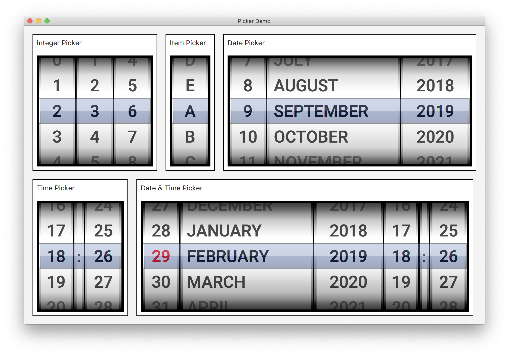

PickerFX is a lightweight framework for creating picker (touch) controls. Currently the only documentation is the source code itself. 
Please take a look at the file DemoApp.java to find out how to use the framework.

 